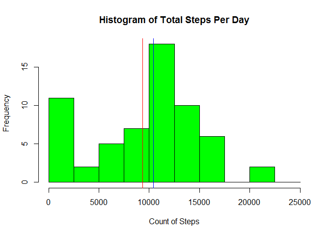
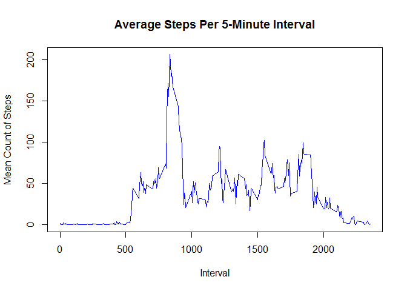
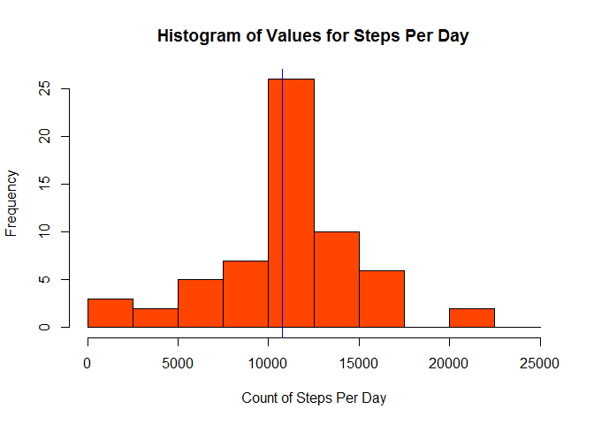
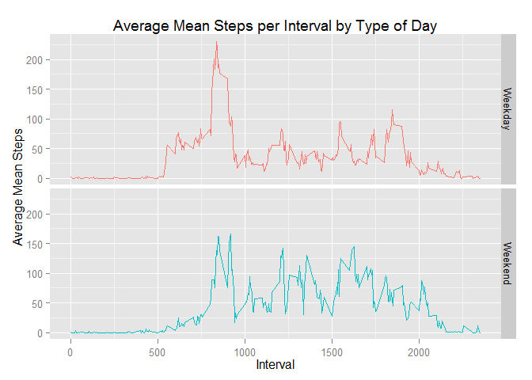

# Activity Monitoring Data Analysis - PA1
Gary A. Miller  
Friday, August 15, 2014  

An analysis of data collected by a personal activity monitoring device between
October and November of 2012.

### Part A - Loading and pre-processing data ### 

This code creates a folder named 'data' in the current directory if it does not
already exist.


```r
if(!file.exists("data")) {
    dir.create("data")
}
```

The Activity dataset is downloaded, unzipped, and stored in the Data folder. 


```r
zipUrl <- "http://d396qusza40orc.cloudfront.net/repdata%2Fdata%2Factivity.zip"
download.file(zipUrl,destfile="./data/ActivityMonitoringData.zip")
unzip("./data/ActivityMonitoringData.zip",exdir="./data",overwrite=TRUE)

DownloadDate <- format(Sys.Date(),"%B %d %Y")
```

I downloaded the data on August 18 2014.

Next, I read the data into R and took a high-level overview. 


```r
Activity <- read.csv("./data/activity.csv")

str(Activity)
```

```
## 'data.frame':	17568 obs. of  3 variables:
##  $ steps   : int  NA NA NA NA NA NA NA NA NA NA ...
##  $ date    : Factor w/ 61 levels "2012-10-01","2012-10-02",..: 1 1 1 1 1 1 1 1 1 1 ...
##  $ interval: int  0 5 10 15 20 25 30 35 40 45 ...
```

```r
summary(Activity)
```

```
##      steps               date          interval   
##  Min.   :  0.0   2012-10-01:  288   Min.   :   0  
##  1st Qu.:  0.0   2012-10-02:  288   1st Qu.: 589  
##  Median :  0.0   2012-10-03:  288   Median :1178  
##  Mean   : 37.4   2012-10-04:  288   Mean   :1178  
##  3rd Qu.: 12.0   2012-10-05:  288   3rd Qu.:1766  
##  Max.   :806.0   2012-10-06:  288   Max.   :2355  
##  NA's   :2304    (Other)   :15840
```

```r
head(Activity,3)
```

```
##   steps       date interval
## 1    NA 2012-10-01        0
## 2    NA 2012-10-01        5
## 3    NA 2012-10-01       10
```

The date column was read in as a factor variable; I converted the datatype to 
Date.


```r
Activity$date <- as.Date(Activity$date)
```

### Part B - Mean and median total number of steps per day ###

The Activity file gives a number of steps for each 5-minute interval for each
day in the study.  To find the total number of steps per day (during every
interval put together), I aggregated using functions from the reshape2 package.

The na.rm parameter must be set equal to TRUE, as there are many missing values
in the steps column.


```r
library(reshape2)

DateStepsMelt <- melt(Activity,id="date",measure.vars="steps")
DateStepsSums <- dcast(DateStepsMelt,date ~ variable,sum,na.rm=TRUE)

head(DateStepsSums,3)
```

```
##         date steps
## 1 2012-10-01     0
## 2 2012-10-02   126
## 3 2012-10-03 11352
```

This histogram shows the distribution of full-day step counts in the dataset.
The mean is more severely impacted by the comparatively high number of days with little to no activity recorded.


```r
# Plot histogram
hist(DateStepsSums$steps,main="Histogram of Total Steps Per Day",
     xlab="Count of Steps",col="green",breaks=c(0,2500,5000,7500,10000,12500,
    15000,17500,20000,22500,25000))

# Calculate mean and median
DateStepsMean <- round(mean(DateStepsSums$steps),2)
DateStepsMedian <- median(DateStepsSums$steps)

# Add mean and median to histogram
abline(v=DateStepsMean,col="red")
abline(v=DateStepsMedian,col="blue")
```

 

The mean total steps per day is 9354.23 and the median is 
10395.


### Part C - Average Daily Activity Pattern ###

To get an average number of steps for each of the 5-minute time intervals across
the entire time period of the study, I again reshaped the Activity dataset. 

This time, I aggregated by interval and applied the mean function (again setting
na.rm equal to TRUE) to the step counts.  To make it clear that this value is 
now a mean rather than an absolute count, I changed the column name.


```r
IntervalMelt <- melt(Activity,id="interval",measure.vars="steps")
IntervalStepsMeans <- dcast(IntervalMelt,interval ~ variable,mean,na.rm=TRUE)
names(IntervalStepsMeans)[2] <- "IntervalStepsMean"

head(IntervalStepsMeans,3)
```

```
##   interval IntervalStepsMean
## 1        0            1.7170
## 2        5            0.3396
## 3       10            0.1321
```

A plot helps to visualize the pattern of activity:


```r
plot(IntervalStepsMeans$interval,IntervalStepsMeans$IntervalStepsMean,
     type="l",col="blue",xlab="Interval",ylab="Mean Count of Steps",
     main="Average Steps Per 5-Minute Interval")
```

 

The which.max function makes it easy to find the interval with the highest
average number of steps.


```r
X <- which.max(IntervalStepsMeans$IntervalStepsMean)
Y <- IntervalStepsMeans$interval[X]
```

That interval, #835, matches what we see in the line plot.

### Part D - Imputing missing Values ###

As we saw in the initial summary, there are numerous NAs in the steps column in
our dataset.


```r
NACount <- sum(is.na(Activity$steps))
ObsCount <- round(NACount/nrow(Activity),2)
```
There are precisely 2304, which is 0.13 percent of the total.

One approach to approximating these is to use the average for the interval,
which we have already calcuated.  The original 'Activity' and averaged 
'IntervalStepMeans' dataframes can merge based on the common Interval column.


```r
ImputedActivity <- merge(Activity,IntervalStepsMeans,by="interval")

head(ImputedActivity,3)
```

```
##   interval steps       date IntervalStepsMean
## 1        0    NA 2012-10-01             1.717
## 2        0     0 2012-11-23             1.717
## 3        0     0 2012-10-28             1.717
```

I created a logical vector and added it as a column to continue to show which 
values were imputed after the NAs themselves have been overwritten.


```r
ImputedActivity$imputed <- is.na(ImputedActivity$steps)
```

This loop replaces NAs in the steps column with the value in the 
IntervalStepsMean column in the same row.


```r
for (i in 1:nrow(ImputedActivity)) {
    if (is.na(ImputedActivity$steps[i])==TRUE) {
        ImputedActivity$steps[i] <- ImputedActivity$IntervalStepsMean[i]
    }
}

head(ImputedActivity,3)
```

```
##   interval steps       date IntervalStepsMean imputed
## 1        0 1.717 2012-10-01             1.717    TRUE
## 2        0 0.000 2012-11-23             1.717   FALSE
## 3        0 0.000 2012-10-28             1.717   FALSE
```

To confirm this worked, the NAs can be summed:


```r
Z <- sum(is.na(ImputedActivity$steps))
```

There are 0 NAs remaining in the steps column.

For comparison with Part B, we can now create a new histogram of total step
values and calculate an updated mean and median.


```r
ImpDateStepsMelt <- melt(ImputedActivity,id="date",measure.vars="steps")
ImpDateStepsSums <- dcast(ImpDateStepsMelt,date ~ variable,sum)
```


```r
hist(ImpDateStepsSums$steps,main="Histogram of Values for Steps Per Day",
     xlab="Count of Steps Per Day",col="orangered",
     breaks=c(0,2500,5000,7500,10000,12500,15000,17500,20000,22500,25000))

# Calculate new mean and median
ImpDateStepsMean <- round(mean(ImpDateStepsSums$steps),2)
ImpDateStepsMedian <- median(ImpDateStepsSums$steps)

# Add new mean and median to histogram
abline(v=ImpDateStepsMean,col="red")
abline(v=ImpDateStepsMedian,col="blue")
```

 

Using the imputed values, the mean total number of steps per day increased from 
9354.23 to 1.0766 &times; 10<sup>4</sup>, while the median increased from
10395 to 1.0766 &times; 10<sup>4</sup>.  The number of observations in
the lowest bin visibly decreased.

### Part E - Weekend vs. Weekday Activity Patterns

One question we can answer with this data is whether the participant activity changed noticeably between weekedays and weekends.  I added two new columns to 
the Imputed Activity dataset - first the actual name of the day the observations were recorded, and then whether that was a weekday or weekend ('daytype').


```r
ImputedActivity$dayname <- weekdays(ImputedActivity$date)
ImputedActivity$daytype <- as.factor(ifelse(ImputedActivity$dayname %in%
                            c("Saturday","Sunday"),"Weekend","Weekday"))
```

The dataframe was reordered during the merge; here I am resorting by date.


```r
ImputedActivity <- ImputedActivity[order(ImputedActivity$date),]
head(ImputedActivity,3)
```

```
##     interval  steps       date IntervalStepsMean imputed dayname daytype
## 1          0 1.7170 2012-10-01            1.7170    TRUE  Monday Weekday
## 63         5 0.3396 2012-10-01            0.3396    TRUE  Monday Weekday
## 128       10 0.1321 2012-10-01            0.1321    TRUE  Monday Weekday
```

To aggregate the imputed steps by daytype and also 5-minute interval (again 
across the full timespan of the study), I apply the mean function while
reshaping with two id variables.


```r
ImpDaytypeIntervalMelt <- melt(ImputedActivity,id.vars=c("daytype","interval"),
                               measure.vars="steps")
ImpDaytypeIntervalMeans <- dcast(ImpDaytypeIntervalMelt,daytype + interval
                                 ~ variable,mean)

names(ImpDaytypeIntervalMeans)[3] <- "Mean"

head(ImpDaytypeIntervalMeans,3)
```

```
##   daytype interval   Mean
## 1 Weekday        0 2.2512
## 2 Weekday        5 0.4453
## 3 Weekday       10 0.1732
```

This visualization indicates that activity peaks during the same interval both during the week and on weekends.  It also appears that this peak is lower during
weekends.  Activity during the week is centered around four fairly evenly spaced
spikes while weekend activity has more overall variability. 


```r
library(ggplot2)

g <- ggplot(ImpDaytypeIntervalMeans,aes(interval,Mean))

p <- g + facet_grid(daytype ~ .) +
    geom_line(aes(color=daytype)) +
    labs(x="Interval") +
    labs(y="Average Mean Steps") + 
    labs(title="Average Mean Steps per Interval by Type of Day") + 
    theme(legend.position="none")

print(p)
```

 

### Citations ###

For more information on the Data Science Specialization and the Reproducible
Research course, please see:

https://www.coursera.org/course/repdata
